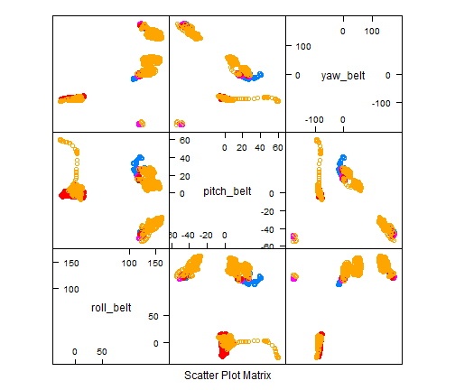

Practical ML: Course Project by Eric Farr
========================================================

Explore the Data
----------------

Load libraries and set seed for repeatable results.

```r
options(warn = -1)
library(caret)
```

```
## Loading required package: lattice
## Loading required package: ggplot2
```

```r
library(ggplot2)
set.seed(101)
```

Load data and split into 70% training and 30% validation.


```r
pml <- read.csv("pml-training.csv")
inTrain <- createDataPartition(y = pml$classe, p = 0.7, list = FALSE)
training <- pml[inTrain, ]
testing <- pml[-inTrain, ]
```

Eliminate columns that are sparsely populated (and not populated in the test data)

```r
mysubset <- c("user_name", "roll_belt", "pitch_belt", "yaw_belt", "total_accel_belt", 
    "accel_belt_x", "accel_belt_y", "accel_belt_z", "gyros_belt_x", "gyros_belt_y", 
    "gyros_belt_z", "magnet_belt_x", "magnet_belt_y", "magnet_belt_z", "roll_arm", 
    "pitch_arm", "yaw_arm", "total_accel_arm", "gyros_arm_x", "gyros_arm_y", 
    "gyros_arm_z", "accel_arm_x", "accel_arm_y", "accel_arm_z", "magnet_arm_x", 
    "magnet_arm_y", "magnet_arm_z", "roll_dumbbell", "pitch_dumbbell", "yaw_dumbbell", 
    "classe")
training <- training[mysubset]
testing <- testing[mysubset]
```


Find significant variables:


```r
train(training[, 3:30], training[, 31], preProcess = c("center", "scale"), method = "rpart")
```

```
## Loading required package: rpart
```

```
## CART 
## 
## 13737 samples
##    28 predictors
##     5 classes: 'A', 'B', 'C', 'D', 'E' 
## 
## Pre-processing: centered, scaled 
## Resampling: Bootstrapped (25 reps) 
## 
## Summary of sample sizes: 13737, 13737, 13737, 13737, 13737, 13737, ... 
## 
## Resampling results across tuning parameters:
## 
##   cp    Accuracy  Kappa  Accuracy SD  Kappa SD
##   0.04  0.4       0.2    0.07         0.1     
##   0.05  0.3       0.1    0.02         0.06    
##   0.07  0.3       0.06   0.02         0.03    
## 
## Accuracy was used to select the optimal model using  the largest value.
## The final value used for the model was cp = 0.04.
```


```r
featurePlot(x = training[, c("roll_belt", "pitch_belt", "yaw_belt")], y = training$classe, 
    plot = "pairs")
```

 


